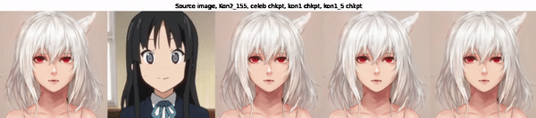
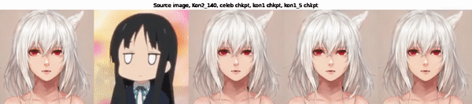
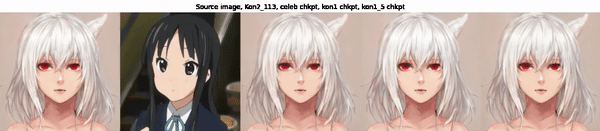
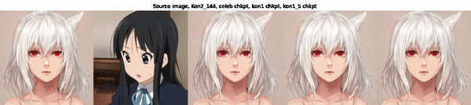

# AnimAI-Tion

Creating machine learning-generated animations from Anime with the First Order Motion Model for Image Animation (https://papers.nips.cc/paper/8935-first-order-motion-model-for-image-animation).

## Fine-tuning the First Order Motion Model

The First Order Motion Model has already been fine-tuned for facial animations, but only on real faces in the celebs dataset.  As a result, using the weights trained on the celebs data set does not translate well over to faces drawn in an anime style.  To produce better results, the First Order Motion Model must first be fine-tuned, which can be done using clips of anime.

### Getting these clips

The crop-vid-yolov5.py file is a script that can be run to first use a Yolo v5 algorithm (https://github.com/ultralytics/yolov5) to detect faces of anime characters in a video file and then crop the video to the bounding boxes and output each frame as a png file in a folder separated by trajectories.  A trajectory is a single bounding box over a scene, so there can be multiple trajectories in the same scene.  These files of images can be used to fine-tune the First Order Motion Model.

The crop-video.py file performs the actions as crop-vid-yolov5.py but instead uses Yolo version 3 and, unfortunatlely, the weights for this model are proprietary to Spellbrush.

#### Fine-tuning the Yolo V5 model

A data set can be downloaded from https://www.kaggle.com/shihkuanchen/kon-characters that contains around 500 images and their respective bounding boxes in text files for faces.  Since these bounding boxes include classes for different characters, clean_kon_bbox_data.py can be run to change the classes in all the text files to a '0' which will represent the presence of a face.  The split_train_val.py file can then be run to randomly split the images and their respective text files into a training and validation set in their respective directories.  These files are in the data_train_yolo folder.

These files can then be used to train a yolov5 model with yolov5/train.py, which, as previously mentioned, is used in crop-vid-yolo5.py.

## Some Results:

From left to right: the source image, driving video, model fine-tuned on celebrity data set, model fine-tuned on 1 episode of K-On!, and model fine-tuned on 5 episodes of K-On!

